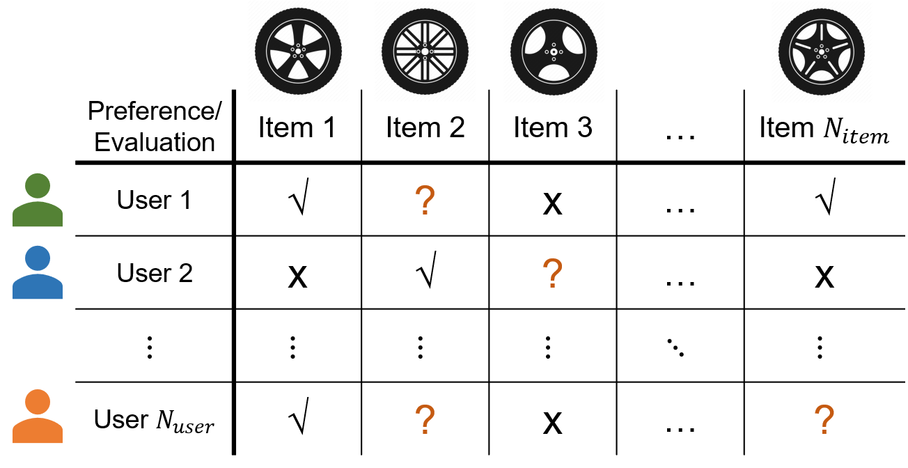
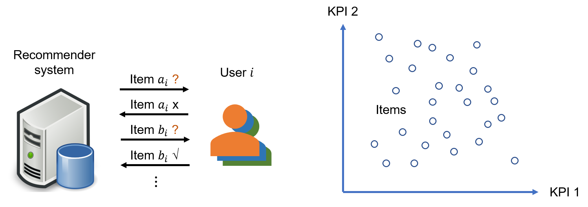
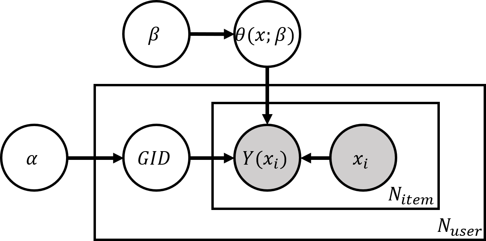

# Recommender Systems with Collaborative Filtering

This repo contains a demo for recommender systems based on user grouping, a collaborative filtering strategy. The user grouping is learned through a generative machine learning model trained with stochastic variational inference.

## 1. Basic Problem Definition

Given a certain number ($N_{user}$) of users and a certain number ($N_{item}$) of items, each user has a deterministic binary preference, i.e., like and dislike, over each item. Each user's preference against each item is deterministic but known only after the user has evaluated the item (see figure below). A recommender system iteratively recommends the items to the users and receives the users' evaluations. Basing the system's recommendation on the users' past evaluation data, the goal is to develop a recommendation algorithm whose recommended items are more likely to be liked by the users.

The items are characterized by a certain number of continuous KPI variables. Each item can thus be located in the KPI space spanned by the KPI variables. Without losing generality and for demo purpose, we assume there are two KPI variables. The KPIs provide similarity associations among the items, i.e., the closer the items are located in the KPI space, the more similar they are.

In this project, we focus on collaborative filtering methods for the recommendation algorithm. One such method will be explained and demonstrated below.

## 2. User Grouping for Collaborative Filtering

One of our collaborative filtering methods is based on user grouping. The users are grouped based on their preferences, and users in the same group have similar preferences. With a collaborative filtering strategy, in a given recommendation iteration, each given user is recommended an item that has been liked by another user in the same group, if such an item exists. Otherwise, other methods, e.g. random recommendation, are used to provide a recommendation.

## 3. Generative Modeling for User Preferences and User Grouping

One way to characterize user preferences and infer the user groups is through generative modeling of the user's evaluation data. The following figure depicts the generative model, and the definitions of the variables are listed below.

- $\alpha$ : prior multinomial distribution parameters for assigning users' group IDs
- $\beta$ : shape parameters for the preference probability function
- $x$ : KPI values representing an item (location in the KPI space)
- $\theta(x;\beta)$ : preference probability function
- $GID$ : a user's group ID with $GID \sim Multinoulli(\alpha)$
- $i$ : index of items evaluated by a given user
- $x_i$ : location of Item $i$ in the KPI space
- $Y(x_i)$ : user's label (like/dislike) for Item $i$ with $Y(x_i) \sim Bernoulli( \theta_{GID}(x_i;\beta) )$

On a high level, the model stipulates a stochastic process through which the users' evaluation data are generated. First, each user is assigned a group ID $GID$ that is generated from $Multinoulli(\alpha)$. Then each user's preference labels (like/dislike encoded as 1/0) $Y(x_i)$ for his/her evaluated items $x_i$ are generated from $Bernoulli( \theta_{GID}(x_i;\beta) )$ based on the group's preference function $\theta_{GID}(x_i;\beta)$. This process involves model parameters $\alpha$ and $\beta$, and latent random variables $GID$. These can be inferred through variational inference technique given the observation data of $Y(x_i)$. We use inferred $GID$ of the users to group them and subsequently produce recommendations.

The model consists of two key components. First, each group's preference is characterized through the preference probability function $\theta(x;\beta)$ parameterized by the parameters $\beta$. This function maps each item located at $x$ in the KPI space to the probability that this item is liked by the users in this group. Generally, this function can be parameterized in any way as long as the output is between 0 and 1. In this project, we use a multi-cluster model, which means that the items that are likely to be liked ($Y(x)$ being 1) cluster around a few centers in the KPI space. Details of one of our models can be found in the case study.

Second, each user's group ID $GID$ is generated from $Multinoulli(\alpha)$. Here, with a Bayesian approach, $\alpha$ are fixed values that reflects the modeler's prior belief on the concentration of the users among the groups. One can also use a non-Bayesian/frequentist approach by dropping the prior distribution $Multinoulli(\alpha)$ and convert $GID$ as model parameters.

The model includes a few hyperparameters. In addition to the hyperparameters for the training process, the modeler needs to specify the number of groups $N_{group}$ and the number of clusters $N_{cluster}$. We recommend to determine $N_{group}$ and $N_{cluster}$ by "elbow rule" in statistical learning. The hyperparameters for the training process can be tuned through techniques such as Bayesian optimization.

## 4. Case Study

We demonstrate how the model parameters and $GID$s are inferred through a simulated case study. In this case study, we have $N_{user}=5$ users who come from $N_{group}=3$ groups. Each user has $40$ evaluation data points in the KPI space. The data are plotted as follows. Each user's liked items form one cluster.

We use Pyro and PyTorch packages for this case study. We use a customized preference probability function in the generative model. The stochastic variational inference method is used to infer the model parameters ($\beta$) and users' $GID$s. The figure below illustrates the training process.

The final learned preference probability functions are plotted below.

